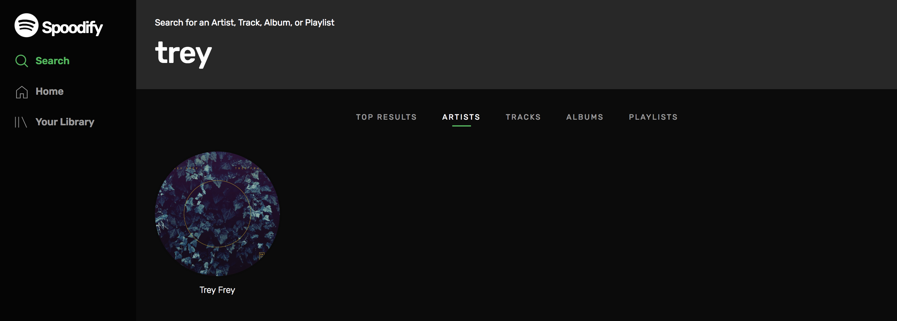
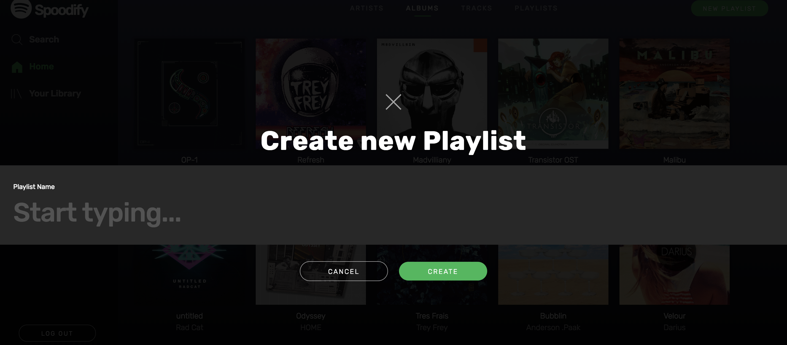
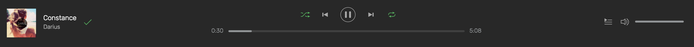
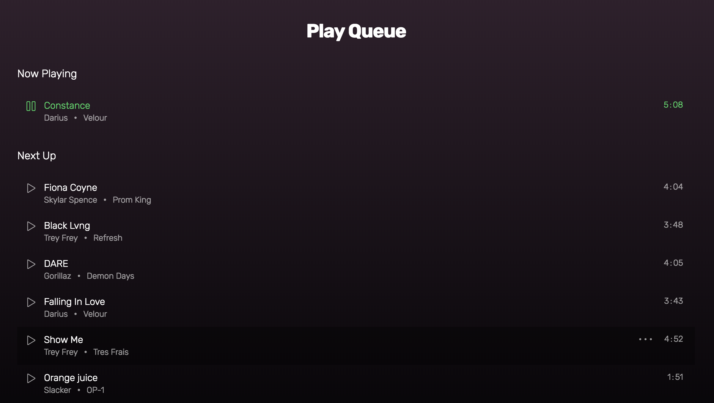

# Welcome to Spoodify

This is Spoodify. A clone of Spotify made in ten days as a full-stack web app project.
[Visit Spoodify Here!](https://spoodify.herokuapp.com/)

## The Front-End

React and Redux was used on the front-end to provide a fast and seamless experience throughout the site that renders and updates dynamically. Effective modular components were also used to provide a consistent and scalable look and feel to the entire site, while not sacrificing in design or user experience. 

## The Back-End

The project was built on top of a Ruby on Rails back-end that communicates with a PostgreSQL database and utilizes assets that are hosted on Amazon Web Services S3. The routes and database queries were optimized to do most of the parsing of data on the database side to cut down on load times on the front-end. 

## Features

### Search

Utilizing effective back-end routes and controllers, the search page of the app can quickly and dynamically filter down the entries in the database and provide the relevant results to the user on the front-end. Filters are available to the user on the front-end in case they want to filter by artists, albums, tracks, or playlists. Top result sections are also sorted based on whether or not they contain results that are related to your search query.

### Playlist CRUD

Both a front-end and back-end authentication system was set up to give the users a more tailored and personal experience on the site. This can be seen most notable with the playlist system. Playlists can be created and played by any user, but songs can only be added and removed from a playlist by the user who created it. Additionally, playlists can only be deleted by the user who created it.

### Audio that plays while navigating the site

A core feature for any music app, the audio player is a top-level component for this app. This allows the user to stream music, change the song being played, and save the song being played to their library while navigating around the site.

### Queueing, Shuffling, and Repeat Functionality

The front-end redux state of the app was managed in a way that allows the user to click on a song on the app, and a new queue list will be dynamically generated based on the list of songs currently being viewed. This queue can be viewed at any time, tracks can be added to the queue on the fly, and the queue list can be shuffled and repeated to give the user tons of listening options.

### Saves and Follows

Another essential feature that was added to the app was the ability to save tracks and albums and follows artists and playlists. This allows users to save the things that they like and have it appear in their own personal library any time that they log in.

## Future Plans

In the future, I would like to implement the social aspects of Spotify, like being able to friend other users and share playlists between each other. Also, I have plans to add more ways to categorize the artists, albums, and tracks, such as genre, to add more dimensions to the search and explore pages.

[Visit Spoodify Here!](https://spoodify.herokuapp.com/)
