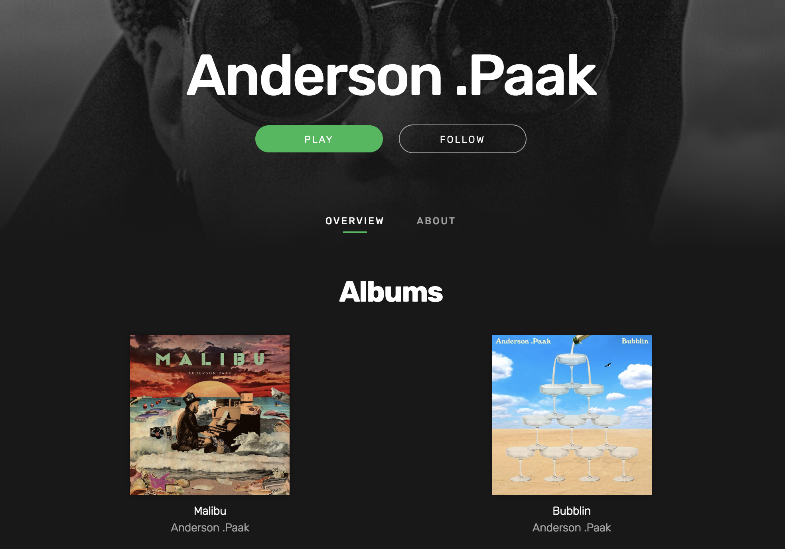

# Welcome to Spoodify

This is Spoodify. A clone of Spotify made in ten days as a full-stack web app project.
[Visit Spoodify Here!](https://spoodify.herokuapp.com/)

## The Front-End

I utilized React and Redux on the front-end to provide a fast and seamless experience throughout the site that renders and updates dynamically. Effective modular components were also used to provide a consistent and scalable look and feel to the entire site, while not sacrificing in the design or user experience of the site. 

## The Back-End

The project was built on top of a Ruby on Rails back-end that communicates with a PostgreSQL database and utilizes assets that are hosted on Amazon Web Services S3. The routes and database queries were optimized to do most of the parsing of data on the database side to cut down on load times on the front-end. 

Additionally, both front and back-end authentication was set up to give the users a more tailored and personal experience on the site.

## Features

### Playlist CRUD

### Audio that plays while navigating the site

### Queueing, Shuffling, and Repeat Functionality

## Future Plans

In the future, I would like to implement the social aspects of Spotify, like being able to friend other users and share playlists between each other. Also, I have plans to add more ways to categorize the artists, albums, and tracks, such as genre, to add more dimensions to the search and explore pages.

[Visit Spoodify Here!](https://spoodify.herokuapp.com/)
